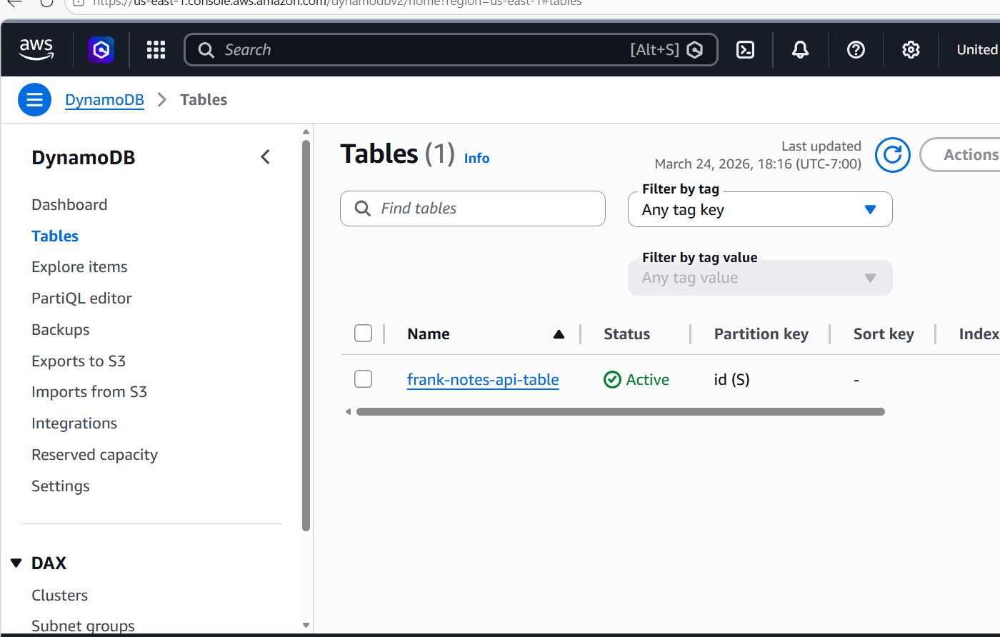
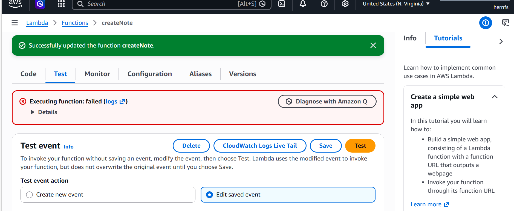
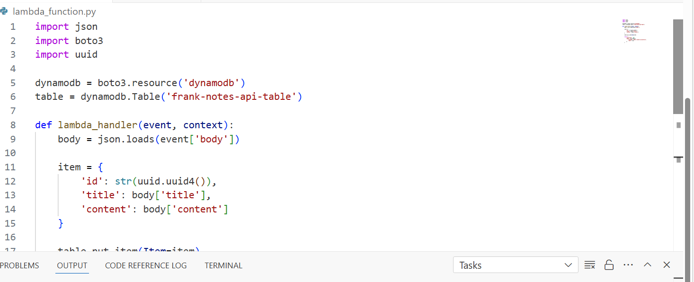
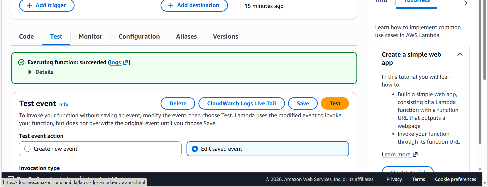
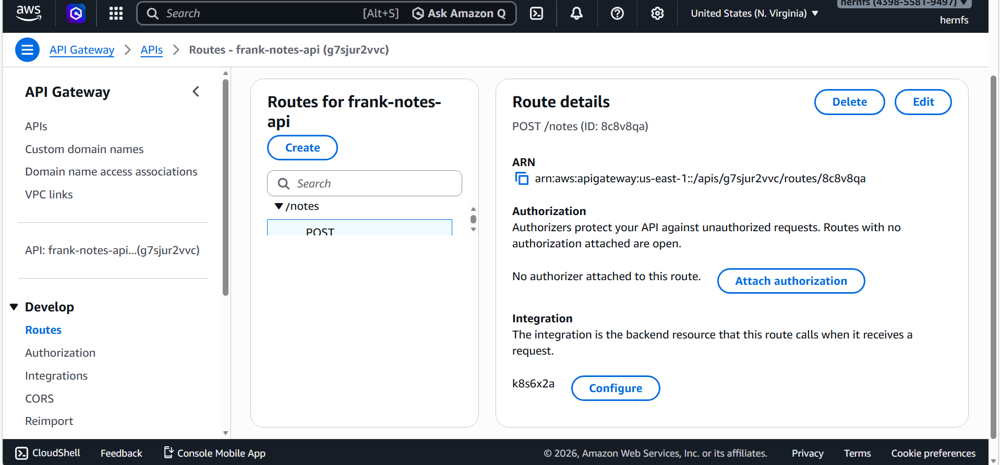
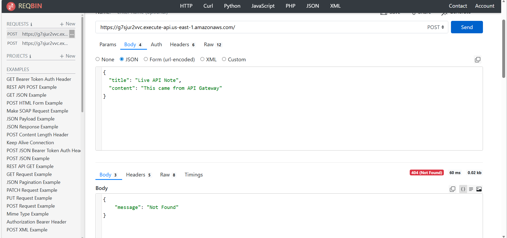
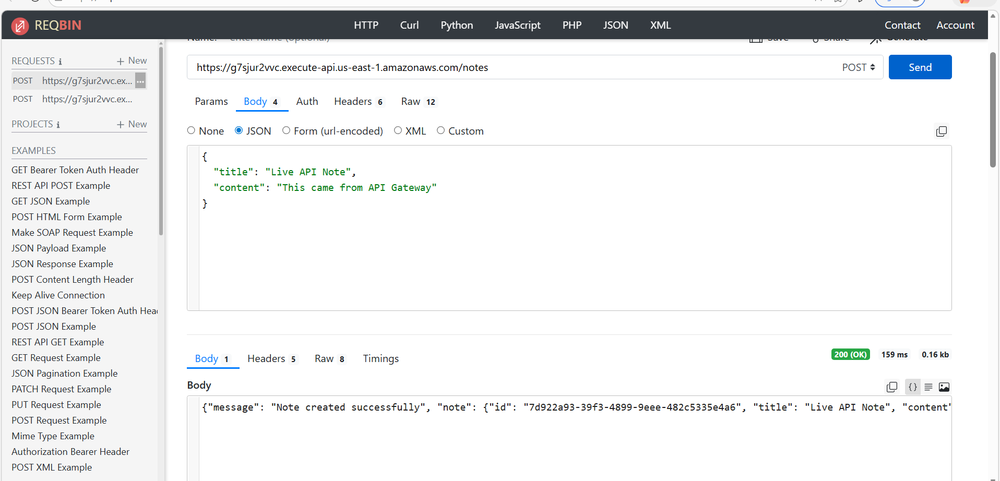

# aws-serverless-notes-api
Serverless notes API built with AWS Lambda, API Gateway, and DynamoDB
## DynamoDB Table Setup

I created a DynamoDB table to store notes for the application.

The table uses a primary key named `id`, which allows each note to be uniquely identified and retrieved.

The screenshot below shows the DynamoDB table after creation.

## Creating the Lambda Function

After creating the DynamoDB table, I moved to AWS Lambda to build the backend logic for the Notes API. I created a Lambda function named `createNote` to handle incoming requests and store note data in DynamoDB.

At this stage, I was testing the connection between Lambda and DynamoDB to ensure the function could successfully write data to the table.

The screenshot below shows an initial test failure. This was an important troubleshooting step, as it helped me identify that the function was not correctly connected to the DynamoDB table.

The issue was caused by referencing the wrong table name in the Lambda code. After correcting the table name and redeploying the function, the test succeeded and the function was able to store data properly.

## Lambda Function Code Implementation

After fixing the initial error, I updated the Lambda function so it could correctly connect to my DynamoDB table and handle incoming data from the API.

The function is written in Python and uses the `boto3` library to communicate with DynamoDB. When a request is sent to the API, the function reads the data from the request body, extracts the note title and content, and generates a unique ID using the `uuid` module.

It then creates a new item with this data and stores it in the DynamoDB table.

This step was important because it built the core backend logic of the application. It allows the system to accept user input and store it reliably in the database, making the API fully functional.

The screenshot below shows the Lambda function code after the issue was resolved.

## Lambda Function Successful Test

After updating the Lambda function and fixing the table name issue, I tested the function again to confirm that it was working correctly.

This time, the function executed successfully. This means the Lambda function was able to receive the input data, process it, and communicate with DynamoDB without any errors.

This step was important because it confirmed that the backend logic of the application was fully working before connecting it to API Gateway.

By successfully running this test, I verified that the function could create and store notes in the database as expected.

The screenshot below shows the successful execution of the Lambda function.

## Creating the API Gateway Route

After confirming that my Lambda function was working correctly, I moved to API Gateway to create a route that allows users to interact with the application.

In this step, I created a `POST /notes` route. This route is used to send data (a note) to the backend. When a request is made to this endpoint, API Gateway forwards the request to the Lambda function I previously built.

I also ensured that the route was properly connected to the Lambda integration. This connection is important because it allows the API to trigger the Lambda function whenever a request is received.

This step was a key part of the project because it transformed the Lambda function into a real, usable API that can accept external requests.

The screenshot below shows the `POST /notes` route successfully created and configured in API Gateway.

## Testing the API with ReqBin

After setting up the API Gateway route, I tested the live API using ReqBin to verify that everything was working correctly from end to end.

In this step, I sent a `POST` request to my API Gateway URL and included a JSON body with sample data:

{
  "title": "Live API Note",
  "content": "This came from API Gateway"
}

The purpose of this test was to simulate a real user sending data to the API and confirm that the request would reach the Lambda function and store the note in DynamoDB.

However, the response returned a **404 Not Found** error. This occurred because the request was sent to the base API URL instead of the full route.

The correct endpoint should include `/notes` at the end of the URL, like this:

https://g7sjur2vvc.execute-api.us-east-1.amazonaws.com/notes

This step was important because it showed that even if the backend is working, the API will fail if the route path is not included correctly.

The screenshot below shows the request being sent in ReqBin and the 404 error response.

## Successful API Test with ReqBin

After identifying and fixing the issue from the previous test, I ran the API request again using ReqBin to confirm everything was working correctly.

In this step, I sent a `POST` request to the correct endpoint:

https://g7sjur2vvc.execute-api.us-east-1.amazonaws.com/notes

I included a JSON body with sample data:

{
  "title": "Live API Note",
  "content": "This came from API Gateway"
}

This time, the request was successful and returned a **200 OK** response. The API responded with a confirmation message that the note was created successfully, along with the saved note data and a unique ID generated by the system.

The reason the previous test failed was because I sent the request to the base API URL without including `/notes`. Since API Gateway routes must match exactly, the request could not be found, which caused the 404 error.

After correcting the URL and using the proper route, the request successfully reached the Lambda function and stored the data in DynamoDB.

This step confirmed that the entire system is fully working:
- API Gateway correctly receives the request  
- Lambda processes the request  
- DynamoDB stores the data  

The screenshot below shows the successful API request and response.

